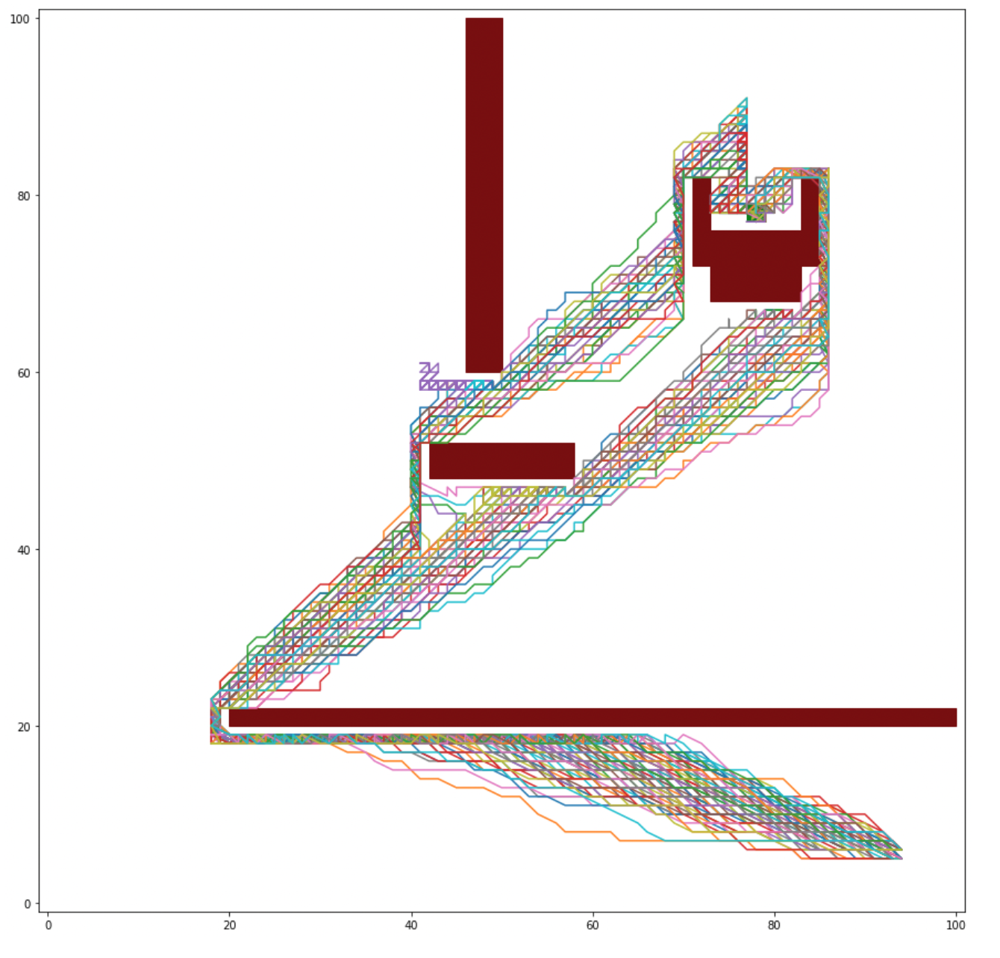

# MDP-airplane

Consider an airplane that moves in a $100\times 100$ grid that is affected by the wind. The goal of the airplane is to reach $[77, 78] \times [77,78]$ in the shortest time possible. The wind is stochastic (see the [probabilities](Taller2DEstocastica.pdf)).

